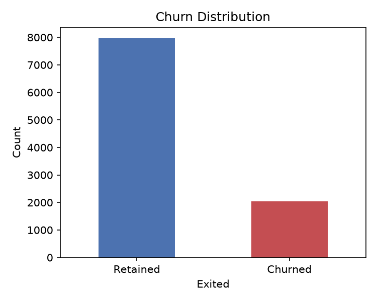
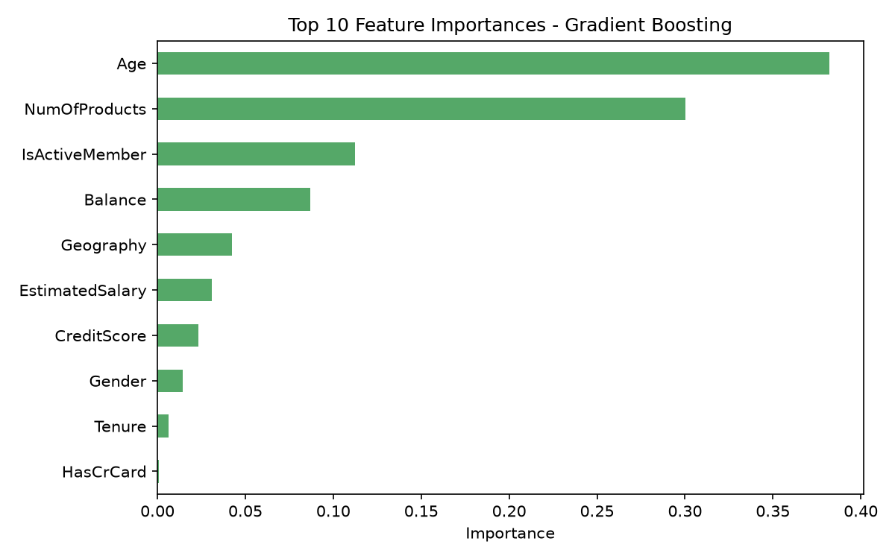

# CODSOFT_TASK3 — Customer Churn Prediction 📉

This repository contains my solution for **Task 3: Customer Churn Prediction**,
completed as part of my Machine Learning Internship at **CodSoft**.

## 📌 Task Objective
Build a machine learning model to predict whether a customer will churn
(cancel their subscription) based on historical customer data, usage
behavior, and demographics.

## 📂 Dataset
[Bank Customer Churn Modelling — Kaggle](https://www.kaggle.com/datasets/shrutimechlearn/churn-modelling) (`Churn_Modelling.csv`)

- 10,000 bank customers (about 20% churned)
- Features include: credit score, geography, gender, age, tenure, balance, number of products,
  credit card ownership, active-member status and estimated salary
- Target: `Exited` (1 = customer left the bank, 0 = customer stayed)

## 🛠️ Approach
1. **Data Cleaning** — dropped the non-predictive `RowNumber`, `CustomerId` and `Surname` columns.
2. **Encoding** — converted categorical features (Geography, Gender) to numeric using Label Encoding.
3. **Feature Scaling** — standardized `CreditScore`, `Age`, `Tenure`, `Balance`, `NumOfProducts` and `EstimatedSalary`.
4. **Model Training** — trained and compared three classifiers:
   - Logistic Regression
   - Random Forest
   - Gradient Boosting
5. **Evaluation** — used Accuracy, Precision, Recall, F1-score, and ROC-AUC.
6. **Feature Importance** — identified the top drivers of churn using the
   best-performing tree-based model.

## 📊 Results
| Model                | Accuracy | Precision | Recall | F1-score | ROC-AUC |
|-----------------------|----------|-----------|--------|----------|---------|
| Logistic Regression   | 0.805 | 0.59 | 0.14 | 0.23 | 0.771 |
| Random Forest         | 0.865 | 0.84 | 0.42 | 0.56 | 0.860 |
| Gradient Boosting     | 0.870 | 0.79 | 0.49 | 0.60 | 0.868 |

Best model (selected by F1-score): **Gradient Boosting**






## 🧰 Tech Stack
- Python
- Pandas, NumPy
- Scikit-learn (Logistic Regression, Random Forest, Gradient Boosting)
- Matplotlib, Seaborn

## 🚀 How to Run
```bash
pip install pandas numpy scikit-learn matplotlib seaborn
python customer_churn_prediction.py
```
Make sure `Churn_Modelling.csv` is in the same folder as the script.

## 📁 Repository Structure
```
CODSOFT_TASK3/
│
├── customer_churn_prediction.py  # Main script
├── churn_distribution.png        # Churn vs Retained class balance
├── model_comparison.png          # Accuracy/Precision/Recall/F1/ROC-AUC comparison
├── confusion_matrix.png          # Confusion matrix of best model
├── roc_curves.png                # ROC curves for all models
├── feature_importance.png        # Top 10 churn-driving features
└── README.md                     # Project documentation
```

## 🎥 Demo
https://lnkd.in/p/dWR4cuhp

## 🙌 Acknowledgements
Completed as part of the **CodSoft Machine Learning Internship**.

#codsoft #internship #machinelearning
